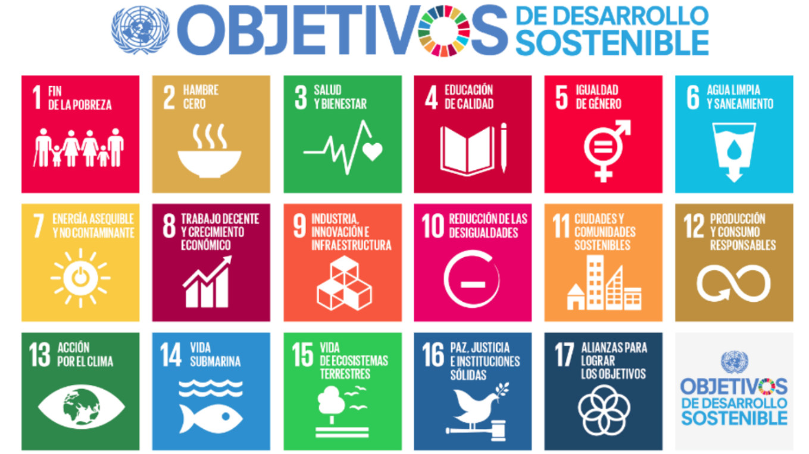

# Marco Mundial: Objetivos de Desarrollo Sostenible (ODS)

Los Objetivos de Desarrollo Sostenible (ODS) establecen una guía global para abordar los principales desafíos ambientales, sociales y económicos. Adoptados por la ONU en la Agenda 2030, buscan equilibrar el crecimiento económico, la inclusión social y la sostenibilidad ambiental.  

Algunos de los ODS más relevantes para este trabajo incluyen:  

- **ODS 12: Producción y consumo responsables**  
  - Fomentar el uso eficiente de los recursos naturales.  
  - Reducir la generación de residuos mediante la prevención, reducción, reciclaje y reutilización.  
  - Promover prácticas empresariales sostenibles y sostenibilidad en las cadenas de suministro.  

- **ODS 13: Acción por el clima**  
  - Reducir las emisiones de gases de efecto invernadero.  
  - Aumentar la resiliencia y la capacidad de adaptación a los impactos climáticos.  
  - Integrar medidas contra el cambio climático en políticas, estrategias y planes nacionales.  

- **ODS 7: Energía asequible y no contaminante**  
  - Asegurar el acceso universal a servicios energéticos modernos y sostenibles.  
  - Aumentar la proporción de energías renovables en la matriz energética global.  
  - Mejorar la eficiencia energética en todos los sectores de la economía.  

- **ODS 9: Industria, innovación e infraestructura sostenibles**  
  - Promover el desarrollo de infraestructuras resilientes y sostenibles.  
  - Apoyar la innovación y la adopción de tecnologías limpias en la industria.  
  - Fomentar la eficiencia en el uso de los recursos y procesos productivos.  

- **ODS 6: Agua limpia y saneamiento**  
  - Garantizar la disponibilidad y la gestión sostenible del agua.  
  - Mejorar la calidad del agua reduciendo la contaminación y minimizando la emisión de productos químicos y desechos peligrosos.  
  - Aumentar la eficiencia en el uso del agua en los sectores productivos.  

- **ODS 15: Vida de ecosistemas terrestres**  
  - Gestionar sosteniblemente los bosques, combatir la desertificación y detener la pérdida de biodiversidad.  
  - Restaurar ecosistemas degradados y fomentar la reforestación.  
  - Fomentar la conservación y el uso sostenible de los ecosistemas terrestres.  

Estos objetivos establecen un marco de referencia fundamental para el desarrollo sostenible a nivel mundial, guiando políticas, estrategias y acciones en distintos sectores productivos.  

Más información: [Naciones Unidas - ODS](https://www.un.org/sustainabledevelopment/es/)  

[Volver a Normativa Ambiental](10_normativa_ambiental_rodrigo.md) | [Ir a Normativa Europea](10.2_normativa_europea_rodrigo.md)  

