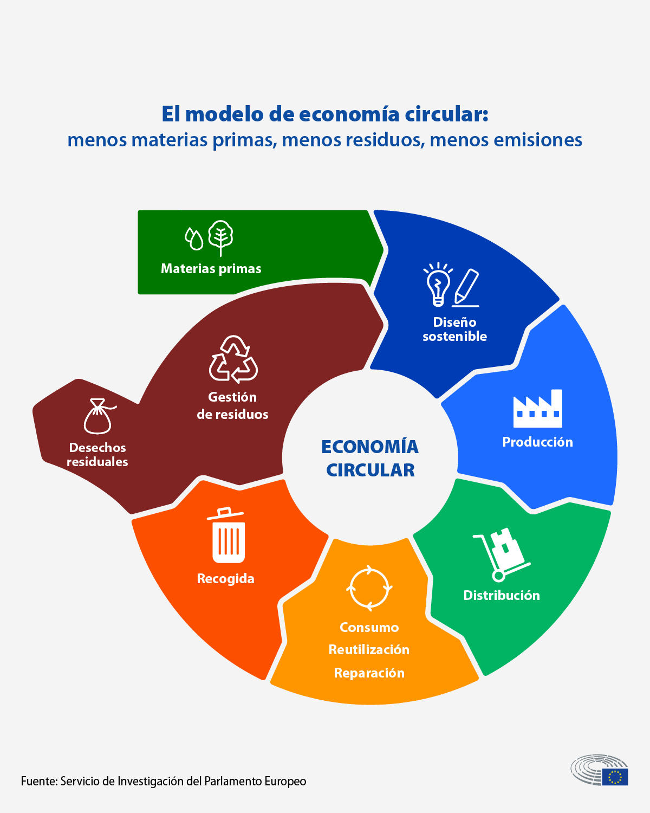

# Normativa Europea

La Unión Europea ha implementado diversas estrategias y regulaciones para fomentar la sostenibilidad y mitigar el impacto ambiental. Estas normativas buscan promover modelos de producción y consumo más sostenibles, proteger la biodiversidad y reducir la huella de carbono en distintos sectores.  

Algunas de las iniciativas más relevantes incluyen:  

- **Plan de Acción de Economía Circular**  
  - Promueve el diseño de productos sostenibles con mayor durabilidad, reparabilidad y reciclabilidad.  
  - Fomenta la reducción de residuos y el uso eficiente de los recursos.  
  - Impulsa la transición hacia modelos de negocio basados en la reutilización y el reciclaje.  

- **Estrategia Europea de Biodiversidad 2030**  
  - Establece objetivos para la protección y restauración de los ecosistemas naturales en Europa.  
  - Propone la ampliación de las áreas protegidas y la reducción del uso de pesticidas y fertilizantes químicos.  
  - Fomenta la reforestación y la conservación de los hábitats naturales para frenar la pérdida de biodiversidad.  

- **Pacto Verde Europeo (European Green Deal)**  
  - Plan integral para lograr la neutralidad climática en Europa para 2050.  
  - Incluye medidas para reducir las emisiones de CO₂ en al menos un 55 % para 2030.  
  - Fomenta la inversión en energías renovables, eficiencia energética y movilidad sostenible.  

- **Reglamento de Taxonomía de la UE**  
  - Define criterios para determinar qué actividades económicas pueden considerarse sostenibles desde el punto de vista ambiental.  
  - Busca evitar el "greenwashing" y orientar la financiación hacia proyectos sostenibles.  

- **Estrategia de Productos Químicos para la Sostenibilidad**  
  - Refuerza la regulación sobre sustancias químicas peligrosas para proteger la salud humana y el medio ambiente.  
  - Promueve el desarrollo de productos químicos más seguros y sostenibles.  

Estas normativas y estrategias forman parte del compromiso de la UE con el desarrollo sostenible y la lucha contra el cambio climático, sentando las bases para un modelo económico más verde y resiliente.  

Más información: [EU Environment](https://ec.europa.eu/environment/)  

[Volver a Normativa Ambiental](10_normativa_ambiental_rodrigo.md) | [Ir a Legislación Española](10.3_legislacion_espanola_rodrigo.md)  
