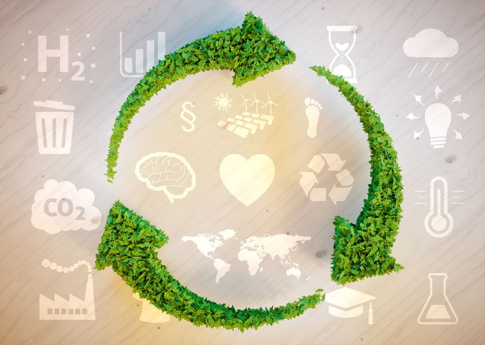

# Legislación Española

En España, la legislación en materia de sostenibilidad está alineada con las directrices de la Unión Europea y busca promover un desarrollo ambientalmente responsable. A continuación, se destacan algunas de las normativas más relevantes:

## **Principales Leyes y Estrategias**

- **Estrategia Española de Economía Circular 2030**  
  - Fomenta la transición hacia un modelo productivo basado en la reutilización, reciclaje y reducción de residuos.  
  - Propone medidas para mejorar la eficiencia en el uso de los recursos naturales.  
  - Establece objetivos para reducir la generación de desechos plásticos y promover la ecoinnovación.  

- **Ley de Residuos y Suelos Contaminados para una Economía Circular (Ley 7/2022)**  
  - Regula la gestión de residuos para minimizar su impacto ambiental.  
  - Introduce impuestos al plástico de un solo uso y fomenta su reducción.  
  - Refuerza las obligaciones de reciclaje y responsabilidad extendida del productor.  

- **Ley de Cambio Climático y Transición Energética (Ley 7/2021)**  
  - Marca la hoja de ruta para alcanzar la neutralidad climática en 2050.  
  - Promueve el uso de energías renovables y la eficiencia energética.  
  - Establece medidas para la descarbonización de sectores clave como transporte e industria.  

- **Plan Nacional Integrado de Energía y Clima (PNIEC) 2021-2030**  
  - Define objetivos para reducir las emisiones de gases de efecto invernadero en un 23 % para 2030.  
  - Establece metas de aumento en la generación de energía renovable y mejora de la eficiencia energética.  

- **Ley de Protección del Medio Marino**  
  - Regula la conservación y uso sostenible de los ecosistemas marinos.  
  - Incluye estrategias para reducir la contaminación y proteger la biodiversidad marina.  

Estas normativas reflejan el compromiso de España con la sostenibilidad y el cumplimiento de los Objetivos de Desarrollo Sostenible (ODS), impulsando un modelo económico más sostenible y resiliente.  

Más información: [Ministerio para la Transición Ecológica](https://www.miteco.gob.es/es/)  

[Volver a Normativa Ambiental](10_normativa_ambiental_rodrigo.md)

