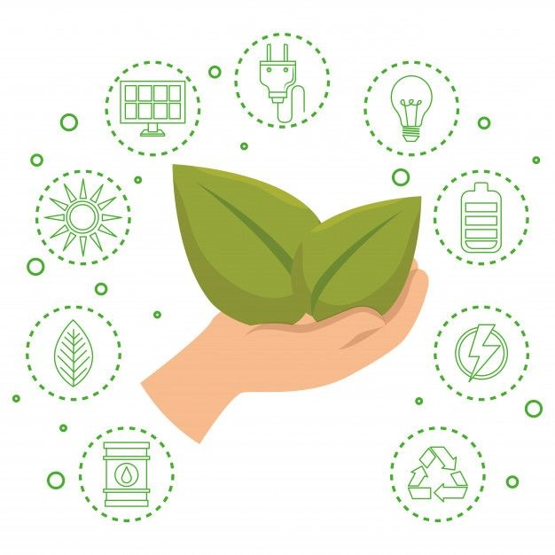

# Sostenibilidad en Productos Lógicos

La producción de software también tiene un impacto ambiental. Algunas estrategias para mejorar su sostenibilidad incluyen:

- **Optimización del código** para reducir el consumo energético, mejorando la eficiencia de los algoritmos y reduciendo la carga computacional.
- **Uso de servidores eficientes** en términos de energía, priorizando centros de datos con certificaciones ecológicas y energías renovables.
- **Reducción de la obsolescencia programada** mediante actualizaciones sostenibles que prolonguen la vida útil del software sin forzar reemplazos innecesarios.
- **Computación en la nube sostenible**, eligiendo proveedores que utilicen energías renovables y optimicen el uso de recursos compartidos.
- **Minimización del almacenamiento innecesario**, evitando el uso excesivo de datos y optimizando bases de datos para reducir el consumo de almacenamiento y procesamiento.
- **Desarrollo de software accesible y eficiente**, evitando funciones innecesarias que aumenten el peso de las aplicaciones y fomentando prácticas de diseño eficiente.

[Volver a Procesos de Sostenibilidad](9_procesos_sostenibilidad_rodrigo.md) | [Ir a Normativa Ambiental](../10_capitulo10_ra4_pisa3_1_rodrigo/10_normativa_ambiental_rodrigo.md)

